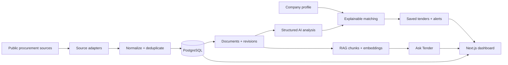

# TenderScout AI

TenderScout AI is an end-to-end procurement intelligence platform for discovering public tenders, analyzing tender documents, matching opportunities against company evidence, answering document-scoped questions, tracking changes, and monitoring deadlines from one workspace.

It is built as a full AI engineering product rather than a standalone LLM demo: source ingestion, persistence, document processing, structured AI analysis, RAG, explainable matching, background jobs, alerts, and a customer-facing dashboard are all part of the same system.

> **Important:** TenderScout match scores represent alignment between known company facts and tender requirements. They are **not** predictions of contract award or win probability.

## Core capabilities

- **Multi-source tender discovery** with normalized ingestion from:
  - Contracts Finder
  - Find a Tender
  - TED
  - World Bank procurement notices
- **Tender persistence and deduplication** with revision/change history.
- **Tender document processing** with controlled PDF download, versioning, and text extraction.
- **Structured AI tender analysis** using versioned prompts and typed outputs.
- **RAG / Ask Tender** with pgvector-backed retrieval and evidence citations.
- **Company profiles** covering capabilities, certifications, experience, and financial facts.
- **Explainable company matching** with matched, unmatched, unknown, and blocking requirements.
- **Saved tenders and shortlists** scoped to an explicitly selected company profile.
- **Alerts and monitoring** for new matches, tender changes, and deadline reminders.
- **Background orchestration** with Celery workers and scheduled monitoring.
- **Customer dashboard** built in Next.js for Overview, Discover, My Matches, Saved Tenders, Company Profile, Alerts, and Settings.
- **CI and PostgreSQL integration checks** through GitHub Actions.

## Product workflow



## Architecture

### Backend

- Python 3.12
- FastAPI
- SQLAlchemy
- Alembic
- PostgreSQL
- pgvector
- Redis
- Celery
- HTTPX
- pypdf
- OpenAI-compatible structured output and embeddings clients

### Frontend

- Next.js 16
- React 19
- TypeScript
- Server-rendered product views with a typed API client

### Infrastructure

- Docker / Docker Compose
- GitHub Actions CI
- PostgreSQL + pgvector service
- Redis broker
- Celery worker / Beat scheduler

## Repository structure

```text
.
├── backend/
│   ├── alembic/              # Database migrations
│   ├── app/
│   │   ├── ai/               # Structured analysis + embeddings
│   │   ├── api/              # FastAPI routes
│   │   ├── models/           # SQLAlchemy models
│   │   ├── rag/              # Chunking, retrieval, Q&A
│   │   ├── scrapers/         # Procurement source adapters
│   │   ├── services/         # Domain / application services
│   │   └── worker/           # Celery configuration and tasks
│   ├── integration/          # PostgreSQL integration checks
│   └── tests/                # Backend tests
├── frontend/                 # Next.js customer dashboard
├── docs/                     # Validation and engineering reports
├── compose.yaml
├── .env.example
└── README.md
```

## Supported procurement sources

| Source | Integration |
| --- | --- |
| Contracts Finder | Official public OCDS search API |
| Find a Tender | Public tender listing adapter |
| TED | Public procurement source adapter |
| World Bank | Public procurement notices API |

Each adapter maps source-specific data into the same normalized tender model before persistence and downstream processing.

## Local development

### 1. Clone and create the Python environment

```powershell
git clone https://github.com/awais-ai-engineer/tenderscout-ai.git
cd tenderscout-ai
python -m venv .venv
.venv\Scripts\Activate.ps1
python -m pip install -r backend/requirements-dev.txt
Copy-Item .env.example .env
```

On Linux/macOS:

```bash
python -m venv .venv
source .venv/bin/activate
python -m pip install -r backend/requirements-dev.txt
cp .env.example .env
```

Update the development values in `.env`. Never commit real secrets.

### 2. Start PostgreSQL and Redis

```powershell
docker compose up -d --wait postgres redis
```

### 3. Apply migrations

```powershell
$env:PYTHONPATH="backend"
.venv\Scripts\python.exe -m alembic -c backend\alembic.ini upgrade head
```

### 4. Run the API

```powershell
$env:PYTHONPATH="backend"
.venv\Scripts\python.exe -m uvicorn app.main:app --app-dir backend --reload
```

API health check:

```text
GET http://127.0.0.1:8000/health
```

Interactive API docs:

```text
http://127.0.0.1:8000/docs
```

### 5. Run the frontend

```powershell
cd frontend
npm install
npm run dev
```

Then open:

```text
http://localhost:3000
```

## Background pipeline

TenderScout includes Celery-based orchestration for background processing and scheduled monitoring.

Typical development processes are:

```text
API
Celery worker
Celery Beat
Next.js frontend
PostgreSQL
Redis
```

The customer-facing product does not require users to manually operate pipeline commands; pipeline execution belongs to the application runtime and scheduled workers.

## Tender analysis and RAG

TenderScout separates AI output from source evidence:

1. Tender documents are stored as immutable document versions.
2. Extracted text is analyzed using structured schemas.
3. Document text is chunked and embedded for retrieval.
4. Ask Tender retrieves relevant document chunks.
5. Answers persist explicit citations back to source chunks/document versions.

The system is designed to keep unsupported facts unknown rather than silently inventing missing evidence.

## Company matching

Company profiles contain user-supplied facts such as:

- capabilities
- certifications
- experience
- employee count
- annual revenue
- years in business
- country and website

Matching compares these facts against analyzed tender requirements and records:

- matched requirements
- unmatched requirements
- unknown requirements
- hard blockers
- capability matches
- certification matches
- experience matches
- risks / ambiguities
- coverage ratio
- fit score

A match score is an explainable alignment score, not an award forecast.

## Customer dashboard

The frontend product flow is centered on:

- **Overview** — procurement activity and deadline intelligence
- **Discover** — live / recorded tender discovery across supported sources
- **My Matches** — company-to-tender alignment results
- **Saved Tenders** — shortlist management
- **Company Profile** — evidence used for matching
- **Alerts** — matching, change, and deadline monitoring
- **Settings** — company-scoped notification preferences

Tender detail views support analysis, documents, revision history, Ask Tender, and company-match context.

## Validation

Backend checks:

```powershell
$env:PYTHONPATH="backend"
.venv\Scripts\python.exe -m unittest discover -s backend\tests
.venv\Scripts\python.exe -m ruff check backend
.venv\Scripts\python.exe -m ruff format --check backend
```

Frontend checks:

```powershell
cd frontend
npm run lint
npm run typecheck
npm run build
```

Database migration head:

```powershell
$env:PYTHONPATH="backend"
.venv\Scripts\python.exe -m alembic -c backend\alembic.ini heads
```

The repository also includes GitHub Actions jobs for backend validation, frontend validation, and PostgreSQL/pgvector integration checks.

See [`docs/task12-report.md`](docs/task12-report.md) for the detailed validation record and known release gates from the hardening pass.

## Current project status

The core product architecture is implemented and the main end-user workflow exists. Before treating the project as production-ready, the remaining work is primarily hardening and deployment work rather than another major product module.

### Remaining production-readiness work

- Final validation of the latest frontend redesign.
- Full local Docker Compose runtime verification after the current UI changes.
- Redis + Celery worker + Beat end-to-end execution against the final build.
- SMTP/email delivery end-to-end validation with a configured development provider.
- Opt-in live AI provider validation for structured analysis, embeddings, and Ask Tender.
- Browser-level interaction and responsive/accessibility checks on the final UI.
- Production authentication and tenant isolation before exposing the application as a public multi-user SaaS.
- Deployment configuration, secrets management, observability, backups, and operational monitoring.
- Performance/load testing with a representative production-sized dataset.

## Known limitations

- Authentication and multi-tenancy are not implemented yet.
- Company facts are user-provided assertions and are not independently verified by TenderScout.
- Matching is deterministic/explainable alignment, not a win-probability model.
- Provider and procurement-source availability can affect live workflows.
- Some AI provider validation is intentionally opt-in and requires configured credentials.
- The system does not claim exactly-once delivery across database and broker boundaries.
- Current source adapters intentionally use bounded public-source access rather than claiming complete global procurement coverage.

## Engineering principles

TenderScout is intentionally built around:

- evidence over unsupported AI claims
- deterministic behavior where possible
- explicit unknown states instead of guessed facts
- versioned documents and revision history
- small, testable service boundaries
- typed API contracts
- durable persistence
- clear separation between AI analysis, retrieval, and business rules

## Author

**Awais Irshad**  
AI Engineer / Developer

- GitHub: [awais-ai-engineer](https://github.com/awais-ai-engineer)
- LinkedIn: [awais-ai-engineer](https://www.linkedin.com/in/awais-ai-engineer)

---

TenderScout AI is an engineering portfolio project focused on practical AI systems, procurement intelligence, RAG, explainable matching, backend architecture, and product-oriented software development.
