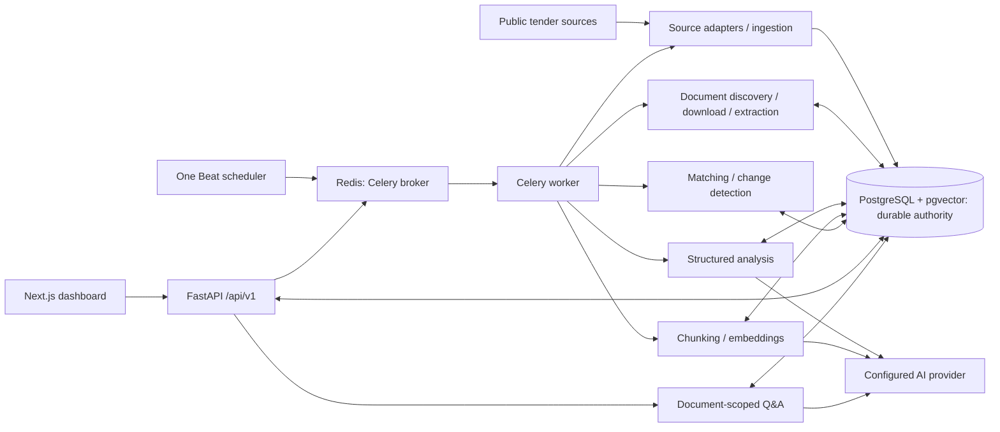

# TenderScout AI

TenderScout AI collects public procurement notices from Find a Tender and Contracts
Finder, preserves document/revision history, and presents evidence-backed analysis,
document-scoped Q&A and deterministic company matching in a Next.js dashboard.
Matching measures heuristic alignment; company facts are user assertions and exact
citations establish provenance, not semantic correctness.

Stack: Python 3.12, FastAPI, SQLAlchemy/Alembic, PostgreSQL/pgvector, Redis/Celery,
OpenAI structured output/embeddings, Next.js 16.3.5, React 19.3.0 and TypeScript.
There is no authentication or tenant isolation; this is a trusted-workspace project,
not a public multi-user deployment.

- [Run the API and dashboard](#product-api-and-dashboard-task-11)
- [Local infrastructure and migrations](#development-setup)
- [Architecture, CI and deployment considerations](#integration-and-deployment-task-12)
- [Exact validation evidence and blockers](docs/task12-report.md)

Local and hosted checks are recorded in the report. GitHub Actions run #1 passed
on commit `10c4e0748d2da1b182d1711a4a60557819f13d98`; this does not establish
a live deployment or accuracy claim.

## Structure

- `backend/app/api`: HTTP routes.
- `backend/app/core`: environment configuration.
- `backend/app/db`: SQLAlchemy engine setup using psycopg.
- `backend/app/models`: tender, document, analysis, company, match and RAG ORM entities.
- `backend/app/ai`: structured output and embedding provider clients.
- `backend/app/rag`: chunking, configuration, answer schema and versioned prompt.
- `backend/app/schemas`: Pydantic create/read data contracts.
- `backend/app/scrapers`: public listing fetching and source-specific parsing.
- `backend/app/services`: tender ingestion, document storage and PDF extraction.
- `backend/alembic`: versioned database migrations.
- `backend/app/main.py`: application and resource lifecycle.
- `backend/app/worker`: Celery configuration, tasks and process lifecycle.
- `frontend/`: Next.js dashboard and typed product API client.
- `backend/integration/`: opt-in PostgreSQL-specific checks.
- `.github/workflows/ci.yml`: backend, frontend and PostgreSQL CI jobs.
- `compose.yaml`: PostgreSQL/Redis and optional API/frontend/worker/Beat services.

## Development setup

Use Python 3.12 or newer and Docker Compose. Run from the repository root:

```powershell
python -m venv .venv
.venv\Scripts\Activate.ps1
python -m pip install -r backend/requirements-dev.txt
Copy-Item .env.example .env
```

On Linux/macOS, activate with `source .venv/bin/activate` and copy with
`cp .env.example .env`. For runtime-only installation, use
`backend/requirements.txt` instead.

Replace the example PostgreSQL password in `.env`, then start:

```text
docker compose up -d --wait postgres redis
python -m alembic -c backend/alembic.ini upgrade head
python -m uvicorn app.main:app --app-dir backend --reload
```

The application reads the repository-root `.env` regardless of working directory;
environment variables take precedence. PostgreSQL credentials are required at
startup. Passwords are redacted in settings representations and JSON serialization;
do not log raw environment variables, explicit secret values, or validation error
input dictionaries.

`POSTGRES_HOST`, `POSTGRES_PORT`, `POSTGRES_DB`, `POSTGRES_USER`, and
`POSTGRES_PASSWORD` configure PostgreSQL. `REDIS_HOST`, `REDIS_PORT`, `REDIS_DB`,
and optional `REDIS_PASSWORD` configure Redis, which now brokers Celery tasks.

Compose binds both services to loopback for local development. Its Redis service
is unauthenticated; `REDIS_PASSWORD` is for a separately configured
authenticated deployment. PostgreSQL and Redis AOF data use named volumes. Changing `.env`
credentials does not change credentials in an already initialized database.
This Compose file is not a production deployment configuration.

## API

```text
GET http://127.0.0.1:8000/health
200 OK
{"status":"ok"}
```

Interactive API documentation is at `/docs`. `/health` reports application
liveness only, not PostgreSQL or Redis readiness. Engine creation is lazy:
startup validates configuration but does not open a database connection.
Connections have a five-second connection timeout, pool checks, and are disposed
at shutdown.

## Verification

```text
python -m unittest discover -s backend/tests
python -m ruff check backend
python -m ruff format --check backend
docker compose config --quiet
```

For the unittest command, set `PYTHONPATH=backend` in your environment first
(`$env:PYTHONPATH = "backend"` in PowerShell, `export PYTHONPATH=backend` on POSIX).
Tests do not require running PostgreSQL or Redis.

## Database migrations

Alembic uses the existing application settings and synchronous SQLAlchemy/psycopg
engine. No credentials are stored in `alembic.ini`, and application startup never
creates tables. Run commands from the repository root:

```text
python -m alembic -c backend/alembic.ini current
python -m alembic -c backend/alembic.ini upgrade head
```

Revision `0001` creates `sources` and `tenders`. Source slugs are unique; tender
external IDs and source URLs are unique within each source. Multiple null
external IDs are allowed. Indexes cover `source_id` and `deadline`.

The source foreign key uses `ON DELETE RESTRICT`, with no ORM delete cascade.
A source with tender history cannot be deleted; deactivate it with `is_active`
instead. All timestamps use PostgreSQL `TIMESTAMP WITH TIME ZONE` and database
`now()` defaults where required. PostgreSQL stores instants independently of the
session timezone. Inputs reject naive datetimes. `updated_at` advances on
SQLAlchemy updates; direct SQL writers must set it themselves. `last_seen_at`
must be set explicitly when an opportunity is observed again.

On a disposable database, test reversal with the commands below. Downgrading to
base deletes all five tables and their records:

```text
python -m alembic -c backend/alembic.ini downgrade base
python -m alembic -c backend/alembic.ini upgrade head
```

Without PostgreSQL, append `--sql` to `upgrade head` or use
`downgrade head:base --sql` to render PostgreSQL SQL only. Settings still require
a password; use a dummy environment value for offline checks. SQL rendering does
not verify live migration execution. The migration tests check generated SQL
against model metadata without a database.

## Supported sources

| Source | Ingestion |
| --- | --- |
| Find a Tender | Public HTML listing, UK4 notices |
| Contracts Finder | Official public OCDS JSON search API, active tender releases |

Both source-specific parsers produce `ScrapedTender` records for the same
transactional ingestion service and PostgreSQL models.

### Find a Tender

The adapter reads the first public [Find a Tender listing page](https://www.find-tender.service.gov.uk/Search/Results)
and selects **UK4: Tender notice** records. It uses HTTPX and Beautiful Soup;
JavaScript rendering, login, and detail requests are not needed for listing data.
The service's [terms](https://www.find-tender.service.gov.uk/Home/TermsAndConditions)
permit reuse of licensed content. The HTML fixture contains public sector
information licensed under the [Open Government Licence v3.0](https://www.nationalarchives.gov.uk/doc/open-government-licence/version/3/).

After configuring PostgreSQL and applying migrations, run from the repository root
with `PYTHONPATH=backend` set as described above:

```text
python -m app.ingest --source find-a-tender
```

To fetch and validate the real listing without database configuration or writes:

```text
python -m app.ingest --source find-a-tender --fetch-only
```

Collected fields are the notice ID, title, buyer/organization, description excerpt,
canonical notice URL, location, publication time, and submission deadline when
present. Category is not supplied by this listing and remains unset. Displayed
English dates are interpreted as `Europe/London` local time and converted to UTC;
unrecognized dates and ambiguous/nonexistent daylight-saving times are rejected.

Each run requests `robots.txt` and one listing page, with an identifiable user agent
and a 20-second HTTPX timeout per network operation. A missing robots file (404) is
allowed; an explicit denial or HTTP failure stops the run. There are no retries,
redirect following, detail requests, or access-control workarounds. A sampled
detail URL returned HTTP 403 during development; only listing access was verified.

Ingestion commits a page in one transaction. A source-row lock serializes concurrent
runs for that source, and source creation handles slug uniqueness with `ON CONFLICT`.
Tenders match by source plus external ID, with source plus canonical URL as fallback.
Conflicting identities are logged and skipped rather than merged. Other database
errors roll back the whole transaction and propagate. Inactive sources are not
reactivated. Existing records keep `first_seen_at` and receive a new `last_seen_at`;
provided mutable values are updated, while missing optional values preserve known
data. Content hashes remain unset because direct field comparison is sufficient.

For either source, the summary reports records discovered, created, changed,
unchanged, failed, and skipped. `changed` means at least one provided normalized
source field changed; `unchanged` means the record was merely seen again. Both
advance `last_seen_at`, which does not itself count as a content change. Missing
optional values preserve known data. Repeated records count as separate observations.
Partial failures return exit code 1 after committing valid records. Source-level
fetch/parse failures and database failures also return 1, without success counts.
Operational logs go to stderr. `--fetch-only` reports valid records, not insert counts.

Coverage is intentionally limited to the first page and UK4 notices. Descriptions
may be truncated; there is no pagination, full detail collection, or category/CPV
extraction. Missing result structure raises an error; a valid zero notice count or
a page containing only other notice types is reported separately. Selectors and
date labels may change. Parser tests use saved HTML and mocked HTTP; ingestion
tests use in-memory SQLite with unchanged production models. They verify business
behavior, not PostgreSQL row locking, concurrency, or live migration execution.

### Contracts Finder

The adapter uses the [documented OCDS search API](https://www.contractsfinder.service.gov.uk/apidocumentation/Notices/1/GET-Published-Notice-OCDS-Search):

```text
GET https://www.contractsfinder.service.gov.uk/Published/Notices/OCDS/Search?stages=tender&limit=20
python -m app.ingest --source contracts-finder
python -m app.ingest --source contracts-finder --fetch-only
```

This public endpoint was verified without login or an API key. One request fetches
at most 20 releases; cursor/next links are not followed. Tender ingestion makes no
record, detail, or document requests. HTTPX uses a 30-second timeout per operation and no
retries or redirects. The API documents a five-minute pause after HTTP 403;
the command stops on that response rather than retrying.

Mapping uses fields observed in the public response:

| Normalized field | OCDS field |
| --- | --- |
| `external_id` | Notice UUID from the official HTML `tender.documents[].url` |
| `source_url` | That same URL, for `documentType=tenderNotice`, `format=text/html` |
| `title`, `description` | `tender.title`, `tender.description` |
| `organization` | `buyer.name`; otherwise matching buyer party or sorted buyer-role names |
| `category` | `tender.mainProcurementCategory` |
| `location` | Distinct sorted `tender.items[].deliveryAddresses[].countryName` values |
| `published_at` | `tender.datePublished`, not the release/package modification date |
| `deadline` | `tender.tenderPeriod.endDate` |

The notice UUID identifies the published notice across release versions. The API's
`ocid` identifies a procurement process; release `id` includes a version suffix,
and `tender.id` is a buyer reference. None replaces notice identity in this adapter.
Each source retains its own identity namespace.

Only active releases tagged `tender`, `tenderUpdate`, or `tenderAmendment` are ingested;
other stages and inactive tenders are skipped. This is a bounded recent batch, not
complete coverage or a guarantee of an unexpired deadline. Countries are delivery
locations, not buyer addresses. Missing optional fields remain absent; malformed
required data or datetimes reject that record. ISO datetimes must carry an offset
and are converted to UTC. An invalid package or wholly malformed batch fails loudly.

The JSON fixture contains two real public releases captured on 2026-09-20, with
contact details, buyer addresses, attachment links, and pagination removed. Its
original OGL license field is retained. Tests never require either live source.
Omitting `--source` keeps the previous Find a Tender default; unknown names are errors.

## Tender documents

Document discovery currently supports **Contracts Finder only**, using
`tender.documents[]` in the same bounded 20-release search response. It reuses the
notice UUID for parent identity and skips the canonical HTML notice. There are no
Find a Tender detail requests. Apply migration `0002` and ingest tenders first:

```text
python -m alembic -c backend/alembic.ini upgrade head
python -m app.ingest --source contracts-finder
python -m app.documents --source contracts-finder
```

Set `PYTHONPATH=backend` as above. Missing parents or inactive sources are skipped;
the command never creates placeholder tenders. The two commands fetch independently,
so a moving recent batch may contain notices not ingested by the previous command.
Metadata-only discovery needs no PostgreSQL configuration, downloads no PDF bodies,
and writes no files:

```text
python -m app.documents --source contracts-finder --fetch-only
```

Revision `0002` adds `tender_documents` (source ID, URL, optional title/type/media
type and observation timestamps) and `document_versions` (SHA-256, size, relative
path, download time and extraction result). Document identity prefers the source
document ID within a tender, with URL fallback; both are uniquely constrained.
Conflicting identities fail without merging. Rediscovery advances `last_seen_at`,
preserves `first_seen_at`, and updates provided fields without clearing omitted ones.
Deleting a tender with documents is restricted. Deleting a logical document cascades
to its versions, in both the ORM and database; it does not remove stored files.

Only metadata explicitly marked `application/pdf` on the observed exact hostname
`www.contractsfinder.service.gov.uk` is automatically downloaded. HTTPS, no URL
credentials, and the default port or port 443 are required. All redirects are
rejected, including same-host redirects. External links and other formats remain
metadata only. Requests use HTTPX streaming, an identifiable user agent, a 10-second
connect/30-second operation timeout, no authentication, no environment proxies,
no retries, and no automatic decompression. Responses must have PDF magic bytes and
either `application/pdf` or `application/octet-stream` content type.

Configuration defaults:

| Setting | Default |
| --- | --- |
| `DOCUMENT_STORAGE_DIR` | `.data/documents`, relative to the repository root |
| `DOCUMENT_MAX_BYTES` | `26214400` (25 MiB), checked against headers and streamed bytes |
| `DOCUMENT_MAX_PAGES` | `500`, checked before text extraction |

Files are SHA-256 hashed while streaming to temporary files. After validation they
are atomically placed at `<first-two-hash-characters>/<sha256>.pdf`; source filenames
are never used. Failed downloads clean up partial files. `.data/` is ignored by Git;
if changing the storage directory, keep that location outside tracked source files.
The storage directory is a trusted local application directory, not shared with
untrusted writers.

Metadata commits before network I/O. A short read detects an existing hash; pypdf
extracts only new versions outside transactions. A final short transaction locks
the logical document and rechecks `(document_id, content_hash)` before inserting.
Content A, A, B therefore retains one logical document and two immutable versions;
the service never updates older version rows. Downloads are repeated to detect
changed bytes; HTTP validators and automatic re-extraction are not implemented.
File storage and the database are not one atomic transaction: a later database
failure can leave an unreferenced, complete hash file. There is no automatic cleanup
of complete files because content can be shared by multiple documents.

pypdf extracts page text separated by blank lines and removes NUL characters.
Statuses are `extracted`, `empty` (valid but no extractable text), and `failed`
(malformed/encrypted PDF, page limit or extraction error). Extraction failure
retains the raw file and version with a concise error. Scanned PDFs may be empty;
OCR is not implemented. Byte/page limits do not provide CPU or memory isolation
against every pathological PDF; extraction currently runs in the CLI process.

The summary separates committed metadata outcomes, new versions, unchanged hashes,
extracted/empty results, failures and skips. These counters describe different
stages and should not all be summed. `discovered` counts valid normalized attachment
observations (including repeated releases); malformed release/attachment metadata
adds to `failed`. Skips include missing parents and unsupported download candidates.
Failures return exit code 1; valid work already committed remains committed.

The document JSON fixture preserves real API attachment metadata captured on
2026-09-20 under OGL v3.0, without contacts. These attachments provide no title;
tests separately inject a clearly synthetic title to check optional-field handling.
`tiny_text.pdf` is a locally generated 973-byte, two-page text fixture, not a
downloaded tender. Unit tests use MockTransport and SQLite for domain behavior,
including A/A/B history, deletion, failure retention and transaction boundaries.
Offline PostgreSQL SQL is checked against all model metadata. Live PostgreSQL
migration, processing, locking and concurrent idempotency remain pending while
Docker/PostgreSQL is unavailable.

## Current limitations

Only Find a Tender and Contracts Finder are integrated. There are no CRUD endpoints,
workers or frontend. Document processing is manual,
Contracts Finder PDF-only, and bounded to one recent API batch. There is no OCR,
DOCX/Excel/ZIP extraction, scheduling, or cloud document storage.

## Structured tender analysis

Analysis runs manually on a single `DocumentVersion` with `extraction_status=extracted`
and nonblank text. Empty/failed extractions are skipped; missing IDs are errors.
Apply migration `0003`, then set `OPENAI_API_KEY` and `AI_MODEL` in the root `.env`
or environment. The key is a redacted `SecretStr`. AI settings are optional for
normal backend startup and document processing. There is no default model: choose
an account-accessible model supporting Responses structured outputs, preferably
a pinned model snapshot when reproducibility matters.

With `PYTHONPATH=backend`:

```text
python -m alembic -c backend/alembic.ini upgrade head
python -m app.analyze --document-version-id 12 --prepare-only
python -m app.analyze --document-version-id 12
```

Replace `12` with an existing extracted version ID. Prepare-only requires database
access but no AI credentials; it reports character count, hash and truncation,
without provider calls, analysis writes or printing document text. Processing
reports document version ID, status, analysis ID, model and `reused`. Failures return
exit code 1; ineligible extractions return `skipped` with exit code 0.

The small `StructuredLLMClient` protocol has one implementation, using the official
OpenAI Python SDK's [Responses structured parsing](https://developers.openai.com/api/docs/guides/structured-outputs).
It sends only the prepared text and versioned extraction instructions, requests
`store=false`, disables SDK retries and provider-side input truncation, uses a
60-second request timeout and an 8,000-output-token ceiling. No tools are supplied.
The API endpoint is fixed to OpenAI; environment proxies and redirects are disabled.
The SDK's HTTP dependency is separate from the existing source download client.

Prompt version **v1** treats document contents as untrusted data, forbids invented
requirements, qualifications, dates or weights, and preserves uncertainty. Analysis
schema version **v1** rejects extra fields and type coercions. Output fields are:

- `summary`: nullable text, with `summary_evidence` quotations when present.
- `eligibility_requirements`, `required_documents`, `technical_requirements`,
  `financial_requirements`, `submission_instructions`, `risks_or_ambiguities`:
  lists of `{value, evidence}`.
- `evaluation_criteria`: `{criterion, weighting, notes, evidence}` items.
- `important_dates`: `{label, date, notes, evidence}` items; dates retain source wording.
- `contact_information`: `{name, organization, email, phone, role, evidence}` items.

Absent facts use null/empty lists. Evidence is limited to 400 characters per item,
and each quote must occur in a retained input section after whitespace normalization.
Quotes from omitted text or across the truncation gap are rejected. Summary evidence
is limited to ten snippets; other lists to 100 items each. Matching a quote does
**not** verify that it supports the claim or that the extraction is complete.
This is structured extraction, not legal advice. Results require human review;
no model-quality benchmark or accuracy claim is provided.

Input preparation converts CRLF/CR to LF, removes NULs and strips outer whitespace,
preserving internal paragraphs and Unicode. `AI_MAX_INPUT_CHARS` defaults to 60,000
(minimum 128). Longer input keeps equal beginning/end portions, giving the beginning
the extra character when needed, with `\n\n... [TRUNCATED BY TENDERSCOUT] ...\n\n`
between them. The marker counts toward the limit. SHA-256 covers the exact UTF-8
prepared text sent as the user message, including the marker, not the binary hash,
IDs, timestamps or system prompt. This is a character bound, not a token estimate;
model context limits may still reject a request. This analysis preparation does not
use chunking or retrieval; Ask Tender has a separate indexing workflow below.

`tender_analyses` stores the document-version FK, schema/provider/model/prompt/input
identity, status, raw response, validated fields, optional failure reason and an
aware creation timestamp. Lists use PostgreSQL JSONB with SQLAlchemy JSON for SQLite
domain tests. The six identity fields have one unique constraint, including failed
results. Exact repeats reuse the row without a provider call. Different prompt,
schema, provider, model, prepared text or document version creates a new row; the
service never updates existing analyses. Model aliases may change upstream behavior;
alias drift is not detected when reusing an existing result.

Failures preserve a concise reason without transport messages, headers or secrets.
Structured columns remain SQL NULL on failure. Successful OpenAI responses retain
the normalized parsed JSON separately from structured columns. Invalid output is
retained when returned to the service, bounded to 100,000 characters; SDK-level
parsing errors, refusals and transport failures retain a reason without the provider
body. Failed results are deliberately reused too: no retry/force mode is implemented.
Changing a version label solely to retry is discouraged because labels describe
actual prompt/schema changes. A future retry policy must preserve prior failures.
NULs and invalid Unicode are rejected in validated fields and escaped in raw audit
text so a malformed response cannot break PostgreSQL text/JSONB storage. Bump the
prompt or schema version whenever its instructions or output contract change.

All reads close before the provider call. A short final transaction locks the
document version, rechecks identity and inserts the result. Concurrent callers can
both incur a provider call, but reuse the first committed result; PostgreSQL locking
still needs live verification. Analysis history restricts deleting its document
version, including deletion through a logical document's version cascade.

Tests use a synthetic source/output fixture, a test-only fake client, and the real
SDK with mocked HTTP transport. Prepare-only is exercised against a SQLite fixture;
this does not verify live PostgreSQL. Live PostgreSQL migration/analysis and a real
LLM call remain pending until a database, extracted version and API credentials are
available. Company matching and Ask Tender are described below.
No proposal generation is implemented.

## Company profiles and deterministic matching

Apply revision `0004` with `alembic -c backend/alembic.ini upgrade head` from
the repository root. Run these commands with `backend` on `PYTHONPATH`, as above:

```powershell
python -m app.company create --file company.json
python -m app.company show --company-id 1
python -m app.match --company-id 1 --analysis-id 5
```

Import JSON uses the structure in
[`backend/tests/fixtures/company_profile.json`](backend/tests/fixtures/company_profile.json),
which is synthetic test data and is never seeded automatically. `name` is required;
optional business fields default to `null`. Monetary amounts are decimal strings,
currencies are three uppercase letters, dates are ISO `YYYY-MM-DD`, and website
URLs must use HTTP(S) without credentials. Unknown fields, negative quantities,
reversed dates and duplicate capability names (casefolded, normalized whitespace)
are rejected. Imports are bounded to 2 MB and commit the parent and children together.
`show` explicitly prints the profile; `match` prints only IDs, status, score,
coverage, result counts and whether the match was reused. Errors omit input bodies
and database/transport messages.

All four completeness flags default to false: `capabilities_complete`,
`certifications_complete`, `experience_complete`, `financials_complete`.
True means the company asserts that collection/data is complete enough for matching;
it is not independent verification. Missing certification, capability or experience
rows otherwise mean **unknown**, not failure. A missing financial amount or currency
remains unknown even when `financials_complete` is true.

Revision `0004` adds only these tables; revisions `0001`–`0003` remain unchanged:

| Model | Stored fields |
| --- | --- |
| CompanyProfile | ID, name, description, country, website, employee count, annual revenue (`Numeric(18,2)`), currency, years in business, four completeness flags, created/updated timestamps |
| CompanyCapability | ID, company FK, name, normalized name key, optional description, creation timestamp; unique company/name key |
| CompanyCertification | ID, company FK, name, optional issuer/identifier/valid-from/valid-until dates, creation timestamp |
| CompanyExperience | ID, company FK, optional title/client/description/country/contract value/currency/start/end dates, creation timestamp; import requires some identifying text |
| TenderMatch | ID, company/analysis FKs, matcher version, eligibility status, nullable integer score, coverage, company snapshot, blocker/matched/unmatched/unknown/capability/certification/experience/risk JSONB lists, creation timestamp |

Company child collections cascade on deletion. Matches restrict deletion of both
their company and analysis to retain audit history. PostgreSQL timestamp columns
are timezone-aware. JSONB has a JSON variant for SQLite tests. Matches have no
`updated_at`; the service never updates prior matches or analyses. This is service
append-only behavior, not a database trigger preventing privileged manual edits.

The unique match identity is `(company_id, tender_analysis_id, matcher_version)`.
`MATCHER_VERSION = "v1"`; result-affecting rule changes must bump it. An exact repeat
reuses its result; another company, analysis or matcher version creates a new row.
Profiles have a create/show workflow, with no update command: import a new profile
for changed assertions. Direct database edits do not invalidate existing matches.
Each result stores its full company snapshot so old comparisons remain interpretable.
The service closes its read session before comparison, then opens a short insert
transaction, rechecks identity and handles uniqueness conflicts. PostgreSQL race
behavior still needs live verification.

The matcher requires a completed, supported-schema analysis and performs no network
calls. It needs no OpenAI API key and adds no LLM explanation layer. Rules use the
existing tender evidence quotations, preserving them verbatim in every result:

- Certification matching recognizes only obvious ISO numeric families (for example,
  ISO 9001, ISO-9001 and ISO 9001:2015). Explicit mandatory holding requirements can
  match an asserted holding. Missing dates never establish validity. Explicit
  `valid`/`current` requirements need both dates covering the **UTC analysis creation
  date**, not today's date. Expired/not-yet-valid records establish a blocker only
  when the certification inventory is complete. Recheck validity before acting.
- Years compare only simple minimum/at-least experience or in-business clauses
  against known years in business; specialist experience clauses remain unknown.
- Country compares only explicit supplier-establishment clauses. The small v1
  parser recognizes UK/United Kingdom/GB and Pakistan/PK company countries;
  other company-country names remain unknown. Delivery location is never used
  as supplier eligibility. Other country clauses need review.
- Financial rules compare obvious minimum annual turnover with asserted annual
  revenue only in the same currency (GBP/£, USD or EUR). Complex clauses, ambiguous
  currency symbols and missing/different currencies remain unknown. No FX lookup.
- Capability and experience alignment uses lowercase ASCII word tokens, removes
  a small explicit stop-word list and requires at least two remaining requirement
  tokens. At least **60%** must occur in one capability's name/description or one
  experience record's title/description/country/client. Experience is selected by
  the word `experience` in the evidence. This is lexical alignment, not semantic
  equivalence, project quality, successful delivery or proof of compliance.
  Numeric, negative and explicit mandatory technical clauses need stronger rules
  or human review. Unsupported clauses remain unknown.
- Required documents remain unknown because there is no document inventory.
  Holding ISO certification does not prove a certificate file exists. Submission
  instructions and evaluation criteria require manual review; they are not
  inferred from company facts. Analysis ambiguities retain their original evidence.

**Eligibility:** `ineligible` means at least one safely parsed hard requirement
contradicts the asserted company facts (including complete certification absence).
`eligible` means at least one hard requirement exists and every identified hard
requirement matched. Otherwise it is `uncertain`. Unparsed eligibility/financial
clauses, document requirements, submission instructions and unsupported mandatory
technical constraints remain unresolved hard requirements, preventing `eligible`.
This is an assessment against supplied data, not independently verified legal status.
`unmatched` means a supported contradiction or a lexical gap in an asserted complete
list; `unknown` means missing data or an unsupported comparison. Lexical gaps never
become hard blockers.

**Score:** an optional integer heuristic alignment score, **not win probability,
AI confidence or legal eligibility certainty**. Each comparable non-hard item has
equal weight: `round_half_up(100 * matched_non_hard / comparable_non_hard)`.
Unknowns and hard requirements do not enter that denominator; no comparable soft
items means `null`. A blocker can coexist with a score of 100.

**Coverage:** `(matched + unmatched) / all considered requirements`, rounded to
six decimal places, or zero when none exist. Considered items are eligibility,
financial, technical, required-document, submission and evaluation requirements;
summary, dates, contacts and ambiguity notes are excluded. Unknowns lower coverage
without counting as score failures. A sparse profile can score 100 with low coverage;
always inspect coverage, blockers and unknowns together.

Tests exercise strict imports, rules, evidence retention, scores, SQLite CLI flows,
transactions, uniqueness, snapshots and deletion, plus offline PostgreSQL migration
rendering. SQLite is not live PostgreSQL verification. Live migration, matching
idempotency and concurrent insertion verification remain pending when PostgreSQL
is unavailable. Human review is required; matching makes no bid/no-bid decision.
There is no automatic proposal generation or automated bidding.

## Ask Tender: document-scoped RAG

Revision **0005** adds document chunks, embeddings and append-only question results.
Use PostgreSQL with the [pgvector extension](https://github.com/pgvector/pgvector).
Compose now uses `pgvector/pgvector:pg17`, retaining PostgreSQL major version 17
and the existing volume. The database migration runs
`CREATE EXTENSION IF NOT EXISTS vector`; the server must have the extension installed
and the migration role must have permission to enable it. Downgrade drops only the
three RAG tables, retaining the potentially shared extension. Revisions 0001–0004
are unchanged. No running database or volume is replaced automatically.

Install the updated requirements, configure the root `.env`, and migrate:

```powershell
python -m pip install -r backend/requirements-dev.txt
$env:PYTHONPATH = "backend"
python -m alembic -c backend/alembic.ini upgrade head
python -m app.index_document --document-version-id 12 --prepare-only
python -m app.index_document --document-version-id 12
python -m app.ask --document-version-id 12 --question "What is the submission deadline?" --retrieve-only
python -m app.ask --document-version-id 12 --question "What is the submission deadline?"
```

Replace `12` with an extracted document version ID. Index prepare-only requires
database access, but no AI key: it reports count and minimum/maximum/average chunk
lengths without writes or provider calls. Retrieve-only requires embedding
credentials, prints ranked IDs and previews bounded to 160 source characters,
and neither calls the answer model nor stores a question. Normal indexing reports
created/reused counts without source text; answering prints the answer, short
citations and question status. Failed commands return exit code 1; insufficient
evidence and skipped ineligible documents are valid outcomes.

| Setting | Default / requirement |
| --- | --- |
| `OPENAI_API_KEY` | Existing secret setting; needed for embedding and answer calls |
| `AI_EMBEDDING_MODEL` | No default; explicitly select an accessible model accepting `dimensions=1536` |
| `AI_EMBEDDING_DIMENSIONS` | `1536`, the only dimension supported by revision 0005 |
| `AI_MODEL` | Existing answer model setting; Responses structured-output support required |
| `RAG_CHUNK_SIZE_CHARS` | `2000`, allowed 256–8000 |
| `RAG_CHUNK_OVERLAP_CHARS` | `250`, nonnegative and strictly less than chunk size |
| `RAG_EMBEDDING_BATCH_SIZE` | `16`, allowed 1–64 |
| `RAG_TOP_K` | `5`, allowed 1–20 |
| `RAG_MAX_CONTEXT_CHARS` | `12000`, allowed 256–64000 |

Models are not assumed interchangeable or available to every account. Embedding
configuration is separate from the answer model. Changing vector dimensions needs
a new migration and a deliberate compatibility plan; setting a different value in
the environment fails validation. Model aliases can change upstream behavior;
prefer pinned snapshots where available. No automatic provider retry is enabled.

**Chunking and indexing.** `CHUNKER_VERSION="v1"` normalizes CRLF/CR to LF, removes
NULs and trims outer whitespace, then chunks the **full** extracted text without
whole-document truncation or summaries. Chunks prefer paragraph endings, then
whitespace boundaries in the latter part of the target window. Overlap is at most
the configured size, shortened when needed to start at a word boundary. A long
unbroken token is cut at the character bound; whitespace-only pieces are omitted.
Offsets are zero-based, end-exclusive Python character positions in normalized
text, not byte offsets, PDF coordinates or page numbers. Each hash is SHA-256 of
the exact UTF-8 chunk text. Empty/failed extractions are skipped.

Chunks retain their size/overlap configuration. An exact rerun reuses them;
changing source text or configuration under the same document/chunker identity
fails instead of overwriting history. Bump the chunker version for a new algorithm
or size/overlap policy and reindex. Retrieval selects only its configured chunker
version; it does not mix old and new sets.

The small `EmbeddingClient` protocol has one production implementation using the
official OpenAI SDK. It sends bounded batches in source order, requests float
vectors and explicit dimensions, validates returned indexes/count/dimensions,
rejects nonnumeric, nonfinite and zero vectors, and converts values to float32 to
match pgvector storage. The input hash covers the exact unsummarized text sent.
API calls run outside database transactions. Chunks commit together; each validated
embedding batch commits separately. A later failure retains valid earlier batches,
and reruns embed only missing chunks. Short writes lock the document and recheck
identity; uniqueness conflicts are handled without overwriting another writer.

**Storage and search.** The new tables are:

| Model | Fields and identity |
| --- | --- |
| `DocumentChunk` | ID, document-version FK, chunk index/version, chunk size/overlap, exact text/hash, start/end offsets, creation timestamp; unique document/version/index |
| `ChunkEmbedding` | ID, chunk FK, provider, model, dimensions, real `VECTOR(1536)`, input hash, creation timestamp; unique chunk/provider/model/dimensions/input hash |
| `TenderQuestion` | ID, document-version FK, normalized question/hash, embedding/answer identities, chunker/retrieval/prompt versions, top-K, context bound/hash/ordered chunk IDs, retrieval outcome, status, nullable answer/failure reason, JSONB citations, creation timestamp |

All three are append-only through the services, without `updated_at`; database
triggers do not prohibit privileged manual edits. FKs restrict deleting indexed
document versions, chunks with embeddings, and versions with question history.
Creation timestamps are timezone-aware. Practical FK indexes support scoped lookup.
Question vectors are not stored. Citation records retain document version, chunk
ID, chunk index and quote; there are **no invented page numbers**.

`RETRIEVAL_VERSION="v1"` uses the pgvector SQLAlchemy
[`cosine_distance` operator](https://github.com/pgvector/pgvector-python#sqlalchemy)
for exact search, with no ANN index yet. Every query filters document version,
chunker version, embedding provider/model/dimensions and input hash. Missing or
partially indexed sets fail clearly before embedding the question. The question
embedding call occurs outside a transaction. Results sort by increasing distance,
then chunk index and ID, and obey top-K. No unvalidated similarity threshold is
used; distance is not confidence. Tests store vectors as JSON in SQLite and install
a test-only cosine function/operator adapter; production queries use real pgvector.

**Grounded answers.** Retrieved chunks are serialized into deterministic JSON
records in rank order. The context cap counts all JSON text and metadata characters.
Whole chunks that exceed remaining capacity are skipped; later smaller chunks can
still fit. There is no mid-chunk truncation marker. Only included chunks may be
cited. No fitting context returns `insufficient` without an answer-provider call.
The question is a separate JSON field; context is explicitly labeled untrusted.

Answer prompt **v1** requires use of supplied text only, no outside knowledge or
missing-fact inference, and citations supporting every factual statement. It tells
the model to ignore document prompt injection, provide no legal advice, and make
no bid/no-bid decision. The existing structured client accepts the narrowly added
answer-schema option; analysis retains its original default schema and behavior.

`TenderAnswerOutput` forbids extra fields and coercion. Supported output requires
an answer of at most 4,000 characters and 1–20 `{chunk_id, quote}` citations with
quotes at most 500 characters. Insufficient output must use
`answer=null`, `citations=[]`, `insufficient_evidence=true`; the CLI displays
“The answer is not established by the indexed tender text.” Quotes are checked
against the exact included chunk after whitespace normalization, never combined
across chunks or matched against metadata. Identical normalized citations are
deduplicated. Invalid IDs, fabricated quotations and malformed outputs produce a
stored `failed` result with no accepted answer/citations. Exact source matching
does **not** prove that every answer claim follows from the quotation, that the
retrieval found every relevant clause, or that prompt injection is always resisted.
Human review is required; there is no RAG quality benchmark yet.

**Question history and failures.** Question normalization changes line endings and
trims only outer whitespace, preserving case and internal spacing. SHA-256 covers
the normalized question sent to both providers and the exact ordered context JSON.
Question identity includes document, question hash, embedding provider/model/dimension,
answer provider/model, chunker/retrieval/prompt versions, top-K, context limit/hash
and whether retrieval succeeded. Exact repeats reuse the saved result without an
answer call, including prior failures. Retrieval and question embedding still run
to establish the current context before reuse. Changed context or relevant identity
creates another row. A retrieval failure is distinct from a subsequent successful
retrieval, so recovery cannot reuse the failed-context row. There is no force/retry
mode that overwrites question history.

Provider errors are sanitized; response bodies, API headers, keys, chain-of-thought
and query vectors are not saved. Questions, source chunks, accepted answers and
quotes are intentionally persisted and should be treated as document data. A
database write failure raises an error instead of claiming a saved answer; storage
failure itself cannot reliably be recorded in that unavailable database.

Tests cover chunking, validation, batches/resumption, idempotency, immutable history,
transaction boundaries, cross-tender isolation, exact PostgreSQL SQL compilation,
citation validation, failures, SDK mock transports and CLI workflows. SQLite tests
and offline migration rendering do **not** establish live pgvector behavior.
Live migration/indexing/retrieval/concurrent writes and real embedding/answer API
verification remain pending while local PostgreSQL/Docker and configured models/
credentials are unavailable. No real embedding or answer request was made for
Task 8 validation. Ask Tender excludes company profiles and matches; it adds no
cross-tender search, external search fallback, conversational history, proposal
generation, frontend, agents, tools, workers or scheduling.

## Revision history and deterministic changes (Task 9)

`Tender` remains mutable current state. Migration **0006** adds three tables;
migrations 0001–0005 are unchanged and no historical data is invented or backfilled.

| Model | Stored fields |
| --- | --- |
| `TenderRevision` | ID, tender FK, sequential revision index, snapshot hash, external ID, title, organization, description, source URL, category, location, published/deadline timestamps, source content hash, observed/created timestamps |
| `TenderMetadataChangeSet` | ID, tender FK, from/to revision FKs, changeset version, has-changes flag, count, changed fields, changes, created timestamp |
| `DocumentAnalysisChangeSet` | ID, logical document FK, from/to analysis FKs, changeset version, has-changes flag, count, category counts, changes, created timestamp |

All three are append-only through application services, have no `updated_at`, and
use timezone-aware timestamp columns. JSON fields use PostgreSQL JSONB and SQLite
JSON. All new FKs use `RESTRICT`: recorded history prevents cascading deletion of
its referenced tender, revisions, document or analyses. Immutability is a service
contract, not a database trigger preventing administrative updates.

**Capture and hashing.** New tenders receive revision 1. A legacy tender receives
a baseline of its stored pre-update state, with its previous `last_seen_at` as
`observed_at`; a changed observation then appends revision 2. This preserves only
the state already stored, not earlier unrecorded history. Incoming `None` fields
continue to preserve known values. Each revision contains the full resulting state.
Last-seen-only updates create no revision. A → B → A creates three revisions:
`(tender_id, revision_index)` is unique, but snapshot hashes are not unique.

SHA-256 covers UTF-8 canonical JSON of the ten source/business fields listed
above, including the source content hash independently of the new snapshot hash.
Keys are sorted, separators compact, Unicode unescaped, and datetimes represented
in UTC with six fractional digits and a `Z` suffix. Naive timestamps are treated
as UTC for SQLite compatibility; production timestamps are aware. Database IDs and
observation/bookkeeping timestamps are excluded. Source strings are not normalized.

Existing ingestion locks serialize revision indices. Current-state updates, revision
writes and automatic previous-to-new metadata changesets share the ingestion
transaction and roll back together. Existing created/changed/unchanged/failed/skipped
counters keep their meaning. Unchanged observations produce no changeset.

**Metadata comparisons.** Both revisions must exist, belong to one tender and have
strictly increasing revision indices. Each business field is compared in fixed
order: null to value is added, value to null removed, otherwise modified. Sparse
ingestion does not itself clear a field. Short values are retained exactly;
descriptions and strings over 240 characters use SHA-256 hashes and 240-character
previews, with full values retained in the revisions.

**Structured comparisons.** Both analyses must be completed and refer to different
versions of the same logical `TenderDocument`. Ordering uses `(downloaded_at, id)`.
Schema, provider, model and prompt version must match; only the supported analysis
schema is accepted. Same-version, reversed, cross-document and model/prompt-drift
comparisons are rejected. Validated structured facts are compared, never raw model
response strings. No LLM, embedding or HTTP request is used for diffing.

Value lists first match by casefolded, whitespace-normalized exact value. Evidence
changes still produce a modified record. Identical repeated-key payloads pair first
so reordering is not a change; ambiguous remaining same-key pairs require review.
Unmatched items may pair within their category using token-set Jaccard similarity
at **`Decimal("0.75")`**, inclusive. Tokens include whole numbers, currency/sign
symbols, words (including negations), and adjacent alphabetic word pairs. At least
three distinct alphabetic words are required. This word-pair component permits the
short annual-turnover example to meet the threshold. Candidates sort by descending
similarity, then old index, then new index; each item is used once. Lexical pairs
are marked `requires_review=true`; this is not semantic equivalence. Unpaired items
remain removed/added.

Important dates match normalized labels and preserve exact source date wording,
notes and evidence, including uncertain dates. Evaluation criteria match normalized
criterion names and detect weighting, notes and evidence changes. Contacts first
remove identical payloads, then match unique normalized email, then unique name plus
organization; uncertain identities remain added/removed. Changed normalized summary
or summary evidence produces a review-required change, not independent proof of a
legal change. Detailed old/new items retain exact evidence and original wording.
Category counts are unweighted factual counts, with no materiality or impact score.

**Persistence.** `CHANGESET_VERSION = "v1"`. The same ordered pair plus version
reuses its row; a version bump appends another row without overwriting history.
Every future result-affecting algorithm change must bump this constant. Standalone
comparisons read immutable inputs, close the session, compute, then recheck and
persist in a short transaction, with unique-constraint race recovery. Automatic
metadata comparison deliberately stays inside ingestion's transaction for atomicity.

From the repository root with `PYTHONPATH=backend`, after migrating the database:

```shell
python -m app.changes history --tender-id 5
python -m app.changes history --tender-id 5 --after-index 100 --limit 100
python -m app.changes metadata --from-revision-id 12 --to-revision-id 13
python -m app.changes document --from-analysis-id 20 --to-analysis-id 27
```

History returns at most 100 rows per page with IDs, index, observation/deadline and
hash prefix, never descriptions. Comparisons print at most 25 records with old/new
previews of at most 320 serialized characters each (plus a truncation marker).
Full structured changes remain in the database. These commands need database
configuration, but no AI credentials.

Tests cover revisions, legacy baselines, sparse updates, A → B → A, transaction
rollback, deterministic pairing, comparability, exact evidence, idempotency/version
bumps, CLI bounds, migration SQL, constraints and deletion restrictions. Task 9
tests block HTTP, sockets and AI/embedding clients. SQLite and offline PostgreSQL
SQL rendering do not establish live PostgreSQL behavior: live migration, ingestion,
concurrent writes and database idempotency verification remain **pending** while
PostgreSQL/Docker is unavailable. There are no claims of complete legal-change
detection or document removal: no point-in-time tender-wide document manifest exists.
Results depend on previously captured metadata and completed structured analyses.

## Automated processing and scheduling (Task 10)

Celery **5.6** with its Redis extra runs thin wrappers around the existing services.
Redis is the broker. PostgreSQL is the authoritative operational history; Celery
results are ignored and no result backend is required. An optional
`CELERY_RESULT_BACKEND` accepts a Redis/rediss URL, but does not replace the audit.
`CELERY_BROKER_URL` defaults to the existing Redis settings with an escaped password.
Both overrides are secret settings. Do not dump raw Celery configuration or URLs.

Migration **0007** adds:

| Table | Fields |
| --- | --- |
| `pipeline_runs` | ID, run type (`source_pipeline`), source slug, manual/scheduled trigger, status, root Celery task ID, numeric summary, bounded failure reason, started/finished/created timestamps |
| `pipeline_stage_runs` | ID, run FK, optional parent-stage FK, stage, entity type/ID, status, attempt count, numeric metrics, bounded scope IDs, configuration fingerprint, failure reason, started/finished/created timestamps |

Timestamps are timezone-aware; metrics/summary/scope use PostgreSQL JSONB and SQLite
JSON. FKs restrict audit deletion. A partial unique index permits only one queued
or running run per source. Manual and scheduled triggers use the same path and
return the existing active run on collision; this is not a Redis lock. A unique
`(pipeline_run_id, stage, entity_type, entity_id)` identifies each logical stage.
Stages use one row with an increasing attempt counter (maximum four), not separate
attempt-history rows. Source stages use entity type `source` and ID 0; the run stores
the actual source slug. Task messages contain only a stage ID, or a source slug for
the lightweight Beat trigger. No source text, vectors or provider output is queued.

**Work and bounds.** Ingestion uses the existing two adapters and returns affected
tender IDs through an optional internal collector populated only after commit.
Existing public counters and Task 9 revision capture remain intact. The default
limit is 100 tenders per batch (`PIPELINE_MAX_TENDERS`, maximum 500); truncation is
reported as skipped/limited. There is no whole-database rescan or pagination crawler.

For Contracts Finder, the documents stage fetches the current bounded source batch,
filters document records to those affected tender IDs, and uses the existing secure
PDF processing service. It processes at most `PIPELINE_MAX_DOCUMENTS` records and
selects at most that many latest extracted, nonblank document versions from those
tenders (default 100, maximum 500). Find a Tender documents are explicitly skipped.
Metadata-discovery or per-document failures remain visible in stage counters and
make the run partial while eligible documents continue. Fetching the listing again
can miss a notice that moved out of that source batch; this is not a point-in-time
document manifest. Bounds are reported, not presented as complete source coverage.

Analysis and indexing are independent children of document processing. Both load
their input from the database and close provider clients reliably. AI configuration
is checked at execution, so missing API credentials do not prevent worker startup.
An eligible invoked AI stage with missing configuration is **failed**, not silently
successful. Ineligible text is skipped before client creation. Task 6 exact failed
analysis identities remain failed and are reused without another provider call.
Indexing can still succeed independently and reuses Task 8 chunks/embeddings.

Previously completed pipeline analysis/indexing stages for the same version and
processing configuration are not enqueued again. A fingerprint includes relevant
nonsecret settings and algorithm versions; a worker configuration change after
enqueue fails clearly instead of mixing identities. Use the same settings across
workers. Work performed manually before its first pipeline visit still reuses the
existing domain identities. Missing/failed local follow-up stages are eligible on
later visits. Previously skipped local work is not automatically reopened for an
unchanged configuration, and old superseded document versions are not backfilled.

Completed analyses create independent matching and change-comparison stages.
`AUTO_MATCH_ENABLED=false` skips matching by default. Opt-in matching considers the
first `AUTO_MATCH_MAX_COMPANIES` company IDs in ascending order (default 100, maximum
1000), reporting whether the cap omitted companies. Invalid company data does not
block other companies. Existing match identities are reused. Profiles remain current
unversioned rows; adding companies alone does not backfill already completed stages.

Changes select only the closest previous compatible completed analysis of the same
logical document, ordered by `(downloaded_at, version ID)`, then highest analysis ID
as a deterministic same-version tie-break. Schema/provider/model/prompt must match.
No previous comparable analysis means skipped. Existing metadata changesets are not
duplicated, and document comparisons reuse Task 9 identities. No all-pairs history,
automatic Q&A, notifications, bid decisions or new sources are introduced.

**Status and delivery.** Runs transition queued → running → completed/partial/failed:

- Completed: all planned work is completed/skipped, with no failed counters.
- Partial: downstream failures or record/document failures occurred, while safe work
  continued. A completed batch stage can have failed entity counters; these prevent
  the run from becoming completed.
- Failed: required ingestion could not execute, its publication failed, or explicit
  maintenance declared the run stale.

Stage transitions are queued → running → completed/skipped/failed. A retry returns
running to queued and increments the attempt on its next claim. Run-row locks guard
claims/finalization. Parent completion and creation of queued child rows are atomic;
publication happens after commit. Finalization reads database stage state, not Celery
callback success. A duplicate delivery cannot claim running or terminal work; a
terminal parent can redispatch still-queued children. Domain service identities also
protect repeated writes. This is **not exactly-once execution** or an atomic
database/broker transaction: a crash between commit and publication can strand work.

JSON is the only accepted task/result serialization; pickle is not enabled. Queues:
`ingestion` for source fetch/ingest, `documents` for discovery/PDF work, `ai` for
analysis/embeddings, `default` for triggers/matching/changes. Prefetch is 1. Late
acknowledgements are enabled; failure acknowledgements remain enabled and
`task_reject_on_worker_lost=false` avoids repeated hard-crash delivery loops.
Running-stage duplicates are not automatically taken over after a crash: explicit
stale maintenance and a new run are required. See Celery's
[delivery semantics](https://docs.celeryq.dev/en/stable/userguide/tasks.html).

Retries use Celery's bounded exponential backoff (30-second factor, 180-second cap,
jitter), at most three retries/four attempts. Retryable types are SQLAlchemy
OperationalError, known source timeout/connection failures, and non-persisted
embedding timeout/connection failures. Source adapters expose a sanitized transient
subtype while preserving their existing base exception. No HTTP status, including
403, is retried; neither are validation/schema errors, identity conflicts or stored
failed analyses. Document service failures are recorded rather than blindly retrying
the whole PDF batch. Broker startup/publication retries are also bounded to three.
Database failures can prevent the final audit write; logs contain a fixed diagnostic
and the unfinalized record remains for maintenance. Raw exceptions, SQL values,
provider bodies and credentials are not persisted in pipeline metrics/errors.

Engines are lazy and reused per worker process. Fork hooks discard inherited pools
without closing parent connections; shutdown disposes the local engine. No provider
client is created at import time. Pipeline wrappers hold no outer transaction around
source fetches, PDF download/extraction, LLM or embedding calls.

**Deployment.** Set the repository-root `.env` and apply migrations explicitly:

```shell
docker compose up -d --wait postgres redis
python -m alembic -c backend/alembic.ini upgrade head
docker compose --profile pipeline up -d --build worker beat
```

Worker/Beat use one nonroot backend image, shared environment configuration and
healthy PostgreSQL/Redis dependencies. The `pipeline` profile prevents accidental
worker startup before migration. Workers never run Alembic. The image excludes `.env`
and tests. Redis uses an AOF volume; PDFs and the Beat schedule use separate volumes.
The Compose Redis remains unauthenticated for local use; external authenticated
Redis requires matching settings. For locally run Python processes, use host/port
settings appropriate to the host; container defaults use Compose service names.
Container PDF storage is a named volume, separate from host CLI PDF storage.

Alternatively, with `PYTHONPATH=backend` on Linux:

```shell
celery -A app.worker.celery_app:celery_app worker --loglevel=INFO --concurrency=2 -Q ingestion,documents,ai,default
celery -A app.worker.celery_app:celery_app beat --loglevel=INFO --schedule=.data/celerybeat-schedule
```

Run **one Beat instance**. Both schedule settings default to 60 minutes:
`FIND_A_TENDER_SCHEDULE_MINUTES` and `CONTRACTS_FINDER_SCHEDULE_MINUTES`; 0 disables
an entry, enabled values must be 60–10080 minutes. Beat enqueues lightweight trigger
tasks; database exclusivity applies even if scheduling attempts overlap. Production
`CELERY_TASK_ALWAYS_EAGER=false`; true deliberately executes locally for testing,
including CLI triggers. Eager tests do not establish real broker/worker behavior.
Use the Linux container for production workers rather than Windows prefork.

```shell
python -m app.pipeline run --source contracts-finder
python -m app.pipeline status --run-id 12
python -m app.pipeline status --run-id 12 --after-stage-id 100 --limit 100
python -m app.pipeline recent --limit 20
python -m app.pipeline mark-stale
```

Run prints run ID, root task ID, source, status and collision reuse. Status/recent are
bounded to 100 rows; status returns a next-stage cursor. In normal mode, run enqueues
work and returns without executing the pipeline inline. Inspect PostgreSQL status
for the eventual outcome. CLI returns nonzero for observed failed/partial runs.

Stale maintenance is explicit, never part of ordinary status requests. It marks a
queued/running run and its unfinished stages failed after no recorded run/stage
activity for `PIPELINE_STALE_AFTER_MINUTES` (default 60), with the fixed reason
"Worker execution did not finalize before stale threshold". Set this above expected
stage duration and confirm/stop hung workers before using it: there is no heartbeat,
and maintenance does not cancel in-flight provider calls or fence domain-service
writes. Late stage finalization is rejected. A later scheduled/manual run may then
proceed; it does not reconstruct the failed run's exact source batch. Broker loss,
hard crashes and stale recovery remain operational limitations rather than hidden
successes.

Tests use SQLite, eager Celery with a memory transport, fake source/provider clients,
and socket guards. They cover concurrent run creation (SQLite only), deduplication,
failure continuation, retries, provider transaction boundaries, scope, reuse, CLI,
configuration, migrations and maintenance. Live PostgreSQL locking/migration,
Redis delivery, a real worker, Beat execution and container startup remain **pending**
while local infrastructure is unavailable. No real source/provider call was made
for Task 10 validation; package installation and official documentation lookup are
separate from pipeline execution.

## Product API and dashboard (Task 11)

The `/api/v1` API adapts the existing synchronous services. Matching, analysis,
Q&A, change detection and pipeline rules remain in their existing service modules.
No migration is added: the Alembic head remains **0007**. There is no authentication,
tenant isolation, proposal generation or automatic bidding. Use a trusted local
workspace; CORS is a browser origin policy, not access control.

### Run locally

Configure the root `.env` from `.env.example`, install the backend requirements,
and apply migrations explicitly using the existing setup instructions. Then, from
the repository root in PowerShell:

```powershell
$env:PYTHONPATH = "backend"
.\.venv\Scripts\python.exe -m uvicorn app.main:app --host 127.0.0.1 --port 8000
```

`/health` remains a liveness endpoint, not a database readiness check. Interactive
API documentation is at `http://localhost:8000/docs`, with the schema at
`/openapi.json`. Historical reads need PostgreSQL, but do not contact Redis,
workers or providers. Triggering processing additionally requires Redis and a
worker; use the Task 10 commands. GET requests never run matching or changes again.

In another terminal, using Node.js 24:

```powershell
cd frontend
Copy-Item .env.example .env.local
npm ci
npm run dev
```

Open `http://localhost:3000`. The frontend environment example contains:

```dotenv
NEXT_PUBLIC_API_BASE_URL=http://localhost:8000/api/v1
```

This URL must be reachable **from the browser**. Next.js embeds public environment
variables at build time: set the intended deployment URL before `npm run build`,
then rebuild when it changes. Never put a credential in a `NEXT_PUBLIC_*` variable.
`API_INTERNAL_BASE_URL` optionally overrides only server-rendered requests; Compose
sets it to `http://api:8000/api/v1`. Do not use that container hostname in the public
URL. Without either configured address, the UI reports a configuration error.

Root `CORS_ALLOWED_ORIGINS` is a JSON array of exact HTTP(S) origins, defaulting to
`["http://localhost:3000"]`. Schemes, ports and hostnames must match the browser;
wildcards, credentials, paths, queries and fragments are rejected. No cross-origin
credentials are enabled. An empty array disables cross-origin browser access.

### Routes and contracts

All paths below have the `/api/v1` prefix. IDs are positive integers.

| Method / path | Behavior |
| --- | --- |
| GET `/dashboard/summary` | Factual tender/company counts; at most five deadlines, changes and runs each. |
| GET `/tenders` | Summary rows; filters: `source`, `search`, `organization`, `category`, `deadline_before`, `deadline_after`. |
| GET `/tenders/{id}` | Current metadata, latest revision, bounded document/analysis summaries, latest metadata change and match count. |
| GET `/tenders/{id}/documents` | Logical documents with up to five initial versions each. |
| GET `/documents/{id}/versions` | Older versions with extraction, supported analysis and current embedding-index availability. |
| GET `/tenders/{id}/analyses` | Analysis summaries, including failed attempts. |
| GET `/analyses/{id}` | Validated supported structured facts and evidence; `facts=null` for failed/unsupported records. |
| GET `/document-versions/{id}/analysis` | Latest supported completed analysis; **404** when unavailable. |
| GET, POST `/companies` | Paginated profiles; create with the same strict `CompanyInput` as the CLI, returning **201** and the normalized profile. |
| GET `/companies/{id}` | Company-provided facts and nested capabilities, certifications and experience. |
| POST `/matches` | Existing deterministic matching with `{company_id, analysis_id}`; returns explanation, blockers, unknowns, coverage and heuristic alignment. |
| GET `/matches/{id}` | Saved comparison, without recalculation. |
| GET `/companies/{id}/matches`, `/tenders/{id}/matches` | Saved match summaries. |
| POST `/document-versions/{id}/ask` | `{question}`; document-scoped answer, exact chunk citations and reuse state. |
| GET `/tenders/{id}/revisions` | Revision IDs/indices, observed dates, deadlines and hashes. |
| GET `/tenders/{id}/changes` | Stored comparison summaries; `kind=metadata` (default) or `document`. |
| GET `/changes/metadata/{id}`, `/changes/document/{id}` | Stored old/new facts, evidence and comparison IDs; no recomputation or materiality score. |
| GET, POST `/pipeline/runs` | Recent runs; `{source}` enqueues a supported source and returns **202** with run/task IDs. |
| GET `/pipeline/runs/{id}` | Operational run record and bounded stage page. No stale-maintenance endpoint. |

Growing collections use descending ID cursors: `limit=20` by default, maximum
100, and `cursor=<next_cursor>` from `{items, next_cursor}`. Keep filters unchanged
when following a cursor. Stage history instead preserves the existing ascending
`after_stage_id` cursor and defaults to 100 stages. Tender detail embeds five
documents and 20 analysis summaries; their cursors reach older records. The
dashboard's counts are aggregate SQL queries, not client-side list counts.

Search is literal case-insensitive substring matching on title/organization;
organization/category filters are also substrings. It is not ranked full-text
search. `%` and `_` are escaped. Deadline filters require an explicit timezone.
“Upcoming”/`active_tenders_count` means a recorded deadline at or after the current
UTC time; it does not establish that a notice remains open or has not been cancelled.
Unknown deadlines are excluded. Titles are capped at 2,000 characters in projections
and detail descriptions at 20,000, with an explicit `description_truncated` flag.

Explicit Pydantic summary/detail schemas forbid unexpected fields. Read queries
select necessary columns and use aggregates, correlated subqueries and a grouped
version window query to avoid per-row lookups. Lists omit extracted PDF text,
embeddings, local storage paths, company snapshots and raw provider responses.
Individual structured analysis, match and change details retain bounded evidence.
Requests are capped at **8 MiB**, including chunked bodies. Domain input bounds
still apply; company nested lists remain capped at 200 each. Request bodies larger
than the HTTP cap must be reduced even if their individual fields are valid.

Errors use the documented envelope, without echoing input, provider or SQL internals:

```json
{"error":{"code":"tender_not_found","message":"Tender does not exist"}}
```

Missing resources return 404; invalid input 422; oversized bodies 413; incompatible
analysis or unavailable document index 409; invalid answer/citations 502; missing AI
configuration, unavailable providers/database or pipeline delivery 503. Unexpected
failures return a generic 500. Valid insufficient evidence returns **200** with
`status="insufficient"`. Matching scores are **heuristic alignment, not win
probability**; coverage and unknowns remain separate. User-entered company facts
are not externally verified. Exact citations show provenance, not proof of semantic
correctness.

Ask Tender keeps Task 8's synchronous provider calls and transaction boundaries;
it does not hold a database transaction across those calls. The browser waits up
to 150 seconds; ordinary requests wait 15 seconds. Configure any deployment proxy
request timeout to accommodate at least 150 seconds, since embedding and answer
calls can each take up to 60 seconds. A browser timeout does not cancel server work;
a subsequent request may reuse the durable result. No streaming or chat history is
added. Pipeline POST never runs eager processing inline; eager mode is rejected by
the HTTP adapter. Run status is the durable source of truth after enqueueing.

### Dashboard use

The dashboard uses Next.js **16.3.5**, React **19.3.0**, TypeScript and ESLint,
without a component framework. `/` shows actual counts and recent activity;
`/tenders` provides search/source/deadline filters and cursor links.
`/tenders/[id]` has Overview, Analysis, Documents, Changes, Ask Tender and Matches
tabs. Large tab contents are fetched only when selected. Analysis facts expose
expandable quotes; documents expose version state without paths; change links open
`/changes/[kind]/[id]` with added/removed/modified labels and old/new evidence.

Create a profile at `/companies/new`, inspect it at `/companies/[id]`, then choose
it in a tender's Matches tab. Saved explanations are at `/matches/[id]`. Ask Tender
requires selecting a version indexed for the configured embedding model. There are
explicit empty, loading, insufficient-evidence and error states; no demo data is
substituted when the API is empty or unavailable.

`/pipeline` offers the two supported sources and recent runs; `/pipeline/[id]`
shows attempts, safe failure reasons and metrics. Active runs poll every five
seconds and stop when terminal or unmounted. Shared API URLs/error handling are
centralized in `frontend/lib/api.ts`. Read pages use Server Components; forms,
version loading and polling use Client Components. UTC formatting is centralized.
The layout includes labeled controls, focus outlines, a skip link, semantic tables,
textual statuses, reduced-motion support and responsive sidebar/forms; tables scroll
horizontally on narrow screens. Full browser accessibility testing remains pending.

### Optional Compose product profile

After configuring `.env` and applying migrations explicitly:

```powershell
docker compose --profile product up --build api frontend
```

This starts PostgreSQL as the API's healthy dependency. Redis and workers are not
required for historical reads. To enable manual processing too:

```powershell
docker compose --profile product --profile pipeline up --build
```

API and frontend bind to loopback ports 8000 and 3000. Worker/Beat have no frontend
dependency. The API reuses the backend image and does not run migrations at startup.
The frontend uses a non-root multi-stage standalone image. Compose's public URL
default is for local development only; set `NEXT_PUBLIC_API_BASE_URL` for the actual
browser-visible deployment endpoint and rebuild. Docker execution is pending until
a working daemon is available.

### Validation

Backend commands remain the unittest/Ruff commands above, plus `python -m pip check`.
Product API tests use SQLite fixtures, in-process ASGI requests, fake provider clients
and a mocked pipeline trigger; external socket connections are guarded. They cover
the API contract, filters, cursor bounds, strict profile validation, real matching
and Q&A services, change evidence, safe errors, CORS and bounded projections.

```powershell
cd frontend
npm run lint
npm run typecheck
npm run build
npm run smoke
```

`npm run typecheck` first runs the installed Next.js `next typegen` command.
`frontend/next-env.d.ts` is generated and ignored, so typechecking works after
`npm ci` without a prior build or committed generated types. Index availability
requires the configured chunk size and overlap as well as the embedding model
and dimensions. Citation cards use distinct local keys even when multiple quotes
refer to the same chunk; citation content is unchanged.

The smoke script starts a production Next server on loopback with an isolated
synthetic HTTP API, checks server-rendered pages/empty/error states, then stops both
servers. Its fixtures exist only in the test script. It does **not** validate browser
hydration, action forms, live PostgreSQL, Redis delivery or real provider calls.
Task 12 still needs full deployed browser and infrastructure validation.

The [Task 11 completion report](docs/task11-report.md) records the file inventory,
validation results and remaining live checks.

## Integration and deployment (Task 12)



Analysis and matching use stored structured facts; Q&A retrieves stored chunks.
Redis transports work; PostgreSQL holds domain and operational outcomes. Committing
a run and publishing to the broker are not one transaction, and delivery is not
exactly once. The existing idempotency and explicit stale-run maintenance still apply.

### CI and focused integration checks

CI runs on pushes and pull requests to `main`, with manual dispatch available.
Python 3.12 checks dependencies, Ruff and the full unit suite. Node 24 runs clean
installation, lint, generated-type checking, build and the synthetic SSR smoke test.
A separate PostgreSQL 17/pgvector service applies all migrations from an empty CI
database and runs five focused integration tests: schema/vector type, timezone and
product SQL, vector distance/index readiness, the partial unique active-run index,
and a real conflicting row lock. Jobs do not scrape sources or call AI providers.
Action revisions are pinned, permissions are read-only, and CI credentials are
test-only values for the disposable service. GitHub Actions run #1 completed
successfully on commit `10c4e0748d2da1b182d1711a4a60557819f13d98`:
backend, frontend and PostgreSQL jobs all succeeded. The hosted PostgreSQL job
applied Alembic head `0007` and passed all five integration tests. Local
Docker/Compose, Redis worker/Beat and browser validation remain blocked; see the
report for the separate results.

Run the PostgreSQL tests only against a dedicated disposable database named
`tenderscout_*_test`, using environment variables rather than the ordinary `.env`:

```powershell
# Set POSTGRES_HOST/PORT/USER/PASSWORD and POSTGRES_DB to the disposable database.
$env:PYTHONPATH = "backend"
python -m alembic -c backend/alembic.ini upgrade head
$env:TENDERSCOUT_RUN_POSTGRES_TESTS = "1"
python -m unittest discover -s backend/integration -v
```

Without the opt-in, the five tests explicitly skip. With it, connection/schema
failures fail the suite. The suite requires head `0007`, never drops tables or runs
downgrades, rolls back fixtures, and removes only its identified committed lock-test
row. Use an otherwise empty test database and do not run this against real tender
history. Existing SQLite unit tests remain independently runnable without services.

### Deployment considerations

For local Docker, configure the ignored root `.env` with a generated development
password, then run `docker compose up -d --wait postgres redis`. Apply migrations
explicitly with `python -m alembic -c backend/alembic.ini upgrade head` before
`docker compose --profile product up -d --build api frontend`. Add processing with
`docker compose --profile pipeline up -d --build worker beat`. The API never applies
migrations at startup. Historical reads do not require a worker or broker.

Required connection values are documented in `.env.example`. Set the browser-facing
`NEXT_PUBLIC_API_BASE_URL` before building the frontend; container-only
`API_INTERNAL_BASE_URL` is server-side. Neither URL should contain credentials.
AI settings are needed only for provider work. For deliberate live provider
validation, require both a non-placeholder key and
`TENDERSCOUT_RUN_LIVE_PROVIDER_TESTS=1`; do not trigger an AI-capable pipeline as a
validation shortcut without that opt-in. This flag is a validation policy, not a
new runtime feature gate on ordinary application actions.

Before hosting, provide HTTPS/reverse proxy configuration, private PostgreSQL and
Redis networking, managed secrets, and an access boundary: authentication and
multi-tenancy are **not implemented**, and CORS is not authentication. Preserve
PostgreSQL, Redis and document volumes and own backup/restore procedures. Run one
Beat scheduler; size worker concurrency for PDF memory and provider rate limits
(the local default is two). Keep credentials out of public Next variables and build
contexts. Preserve the 150-second synchronous Ask Tender timeout expectation at
the proxy. Backend and frontend images use non-root users; image builds and volume
behavior require runtime verification on a working Docker host.

No hosted deployment or local performance benchmark is claimed. The
[Task 12 report](docs/task12-report.md) distinguishes verified checks, failures,
blocked integration work and checks that were not run.
